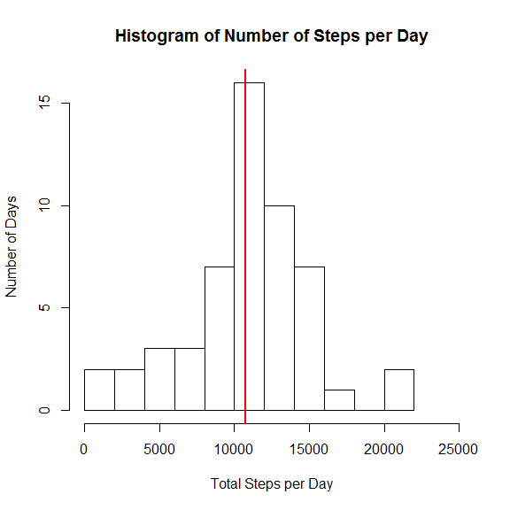
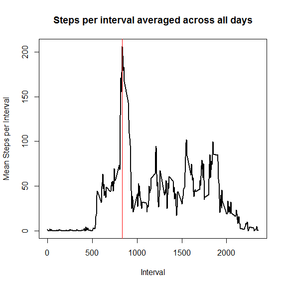
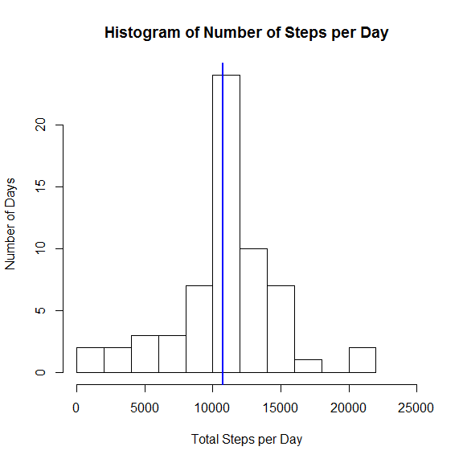
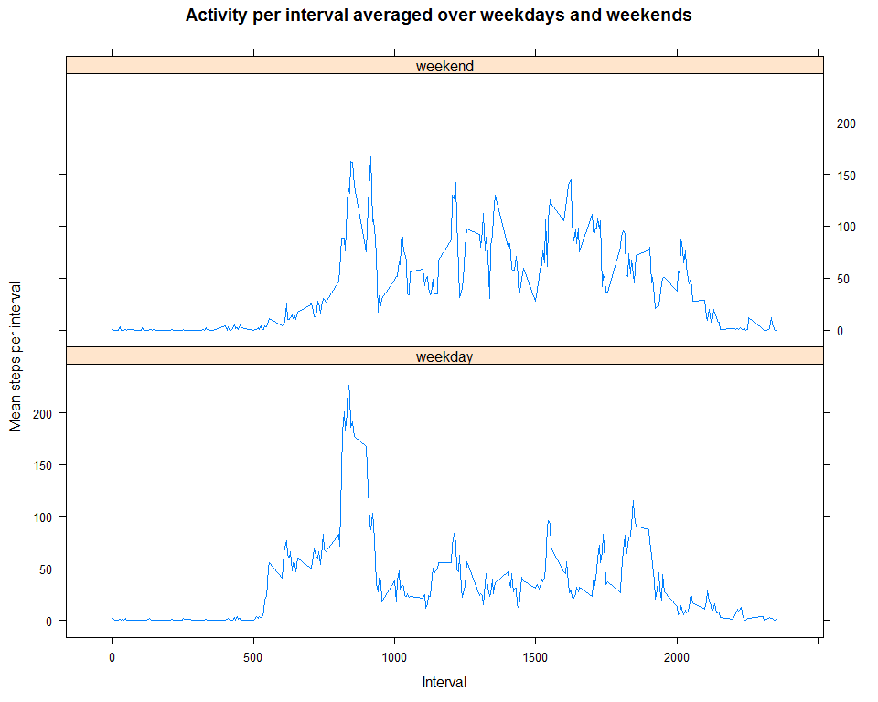

# Reproducible Research: Peer Assessment 1
E McKinnon  
November 2015  


## Loading and preprocessing the data
The raw data is loaded from the working directory and unzipped. Missing values are accounted for
using the string "NA". The date variable is converted into the date class in R.

```r
library(xtable)
```

```
## Warning: package 'xtable' was built under R version 3.1.3
```

```r
library(lattice)
options(scipen=999) #supress exponential notation for numbers
data <- read.csv(unz("activity.zip", "activity.csv"),na.strings = "NA")
activity <- data.frame(steps = data$steps,date = as.Date(data$date),interval=data$interval)
rm(data)
```

The data contains 61 days of activity data over the months October and November 2012. The table below shows what the final processed data looks like, ready for analysis.  

### Format of the Processed Data; table showing the first 6 observations

```r
head(activity)
```

```
##   steps       date interval
## 1    NA 2012-10-01        0
## 2    NA 2012-10-01        5
## 3    NA 2012-10-01       10
## 4    NA 2012-10-01       15
## 5    NA 2012-10-01       20
## 6    NA 2012-10-01       25
```

## What is mean total number of steps taken per day?
We can calculate the total number of steps over the two months and also breakdown the total number of steps per day.

```r
totalsteps <- sum(activity$steps, na.rm = TRUE)
stepsperday <- data.frame(date = unique(activity$date),
                  total_steps= tapply(activity$steps,activity$date,sum))
rownames(stepsperday) <- NULL
```

So in total there were 570608 steps over the two months. The next table shows the total number of steps for each day. 

### Total Number of Steps per day

```r
tab <- xtable(data.frame(totalsteps_per_day = stepsperday$total_steps))
print(tab,type="html")
```

<!-- html table generated in R 3.1.2 by xtable 1.8-0 package -->
<!-- Thu Nov 12 00:13:32 2015 -->
<table border=1>
<tr> <th>  </th> <th> totalsteps_per_day </th>  </tr>
  <tr> <td align="right"> 2012-10-01 </td> <td align="right">  </td> </tr>
  <tr> <td align="right"> 2012-10-02 </td> <td align="right"> 126 </td> </tr>
  <tr> <td align="right"> 2012-10-03 </td> <td align="right"> 11352 </td> </tr>
  <tr> <td align="right"> 2012-10-04 </td> <td align="right"> 12116 </td> </tr>
  <tr> <td align="right"> 2012-10-05 </td> <td align="right"> 13294 </td> </tr>
  <tr> <td align="right"> 2012-10-06 </td> <td align="right"> 15420 </td> </tr>
  <tr> <td align="right"> 2012-10-07 </td> <td align="right"> 11015 </td> </tr>
  <tr> <td align="right"> 2012-10-08 </td> <td align="right">  </td> </tr>
  <tr> <td align="right"> 2012-10-09 </td> <td align="right"> 12811 </td> </tr>
  <tr> <td align="right"> 2012-10-10 </td> <td align="right"> 9900 </td> </tr>
  <tr> <td align="right"> 2012-10-11 </td> <td align="right"> 10304 </td> </tr>
  <tr> <td align="right"> 2012-10-12 </td> <td align="right"> 17382 </td> </tr>
  <tr> <td align="right"> 2012-10-13 </td> <td align="right"> 12426 </td> </tr>
  <tr> <td align="right"> 2012-10-14 </td> <td align="right"> 15098 </td> </tr>
  <tr> <td align="right"> 2012-10-15 </td> <td align="right"> 10139 </td> </tr>
  <tr> <td align="right"> 2012-10-16 </td> <td align="right"> 15084 </td> </tr>
  <tr> <td align="right"> 2012-10-17 </td> <td align="right"> 13452 </td> </tr>
  <tr> <td align="right"> 2012-10-18 </td> <td align="right"> 10056 </td> </tr>
  <tr> <td align="right"> 2012-10-19 </td> <td align="right"> 11829 </td> </tr>
  <tr> <td align="right"> 2012-10-20 </td> <td align="right"> 10395 </td> </tr>
  <tr> <td align="right"> 2012-10-21 </td> <td align="right"> 8821 </td> </tr>
  <tr> <td align="right"> 2012-10-22 </td> <td align="right"> 13460 </td> </tr>
  <tr> <td align="right"> 2012-10-23 </td> <td align="right"> 8918 </td> </tr>
  <tr> <td align="right"> 2012-10-24 </td> <td align="right"> 8355 </td> </tr>
  <tr> <td align="right"> 2012-10-25 </td> <td align="right"> 2492 </td> </tr>
  <tr> <td align="right"> 2012-10-26 </td> <td align="right"> 6778 </td> </tr>
  <tr> <td align="right"> 2012-10-27 </td> <td align="right"> 10119 </td> </tr>
  <tr> <td align="right"> 2012-10-28 </td> <td align="right"> 11458 </td> </tr>
  <tr> <td align="right"> 2012-10-29 </td> <td align="right"> 5018 </td> </tr>
  <tr> <td align="right"> 2012-10-30 </td> <td align="right"> 9819 </td> </tr>
  <tr> <td align="right"> 2012-10-31 </td> <td align="right"> 15414 </td> </tr>
  <tr> <td align="right"> 2012-11-01 </td> <td align="right">  </td> </tr>
  <tr> <td align="right"> 2012-11-02 </td> <td align="right"> 10600 </td> </tr>
  <tr> <td align="right"> 2012-11-03 </td> <td align="right"> 10571 </td> </tr>
  <tr> <td align="right"> 2012-11-04 </td> <td align="right">  </td> </tr>
  <tr> <td align="right"> 2012-11-05 </td> <td align="right"> 10439 </td> </tr>
  <tr> <td align="right"> 2012-11-06 </td> <td align="right"> 8334 </td> </tr>
  <tr> <td align="right"> 2012-11-07 </td> <td align="right"> 12883 </td> </tr>
  <tr> <td align="right"> 2012-11-08 </td> <td align="right"> 3219 </td> </tr>
  <tr> <td align="right"> 2012-11-09 </td> <td align="right">  </td> </tr>
  <tr> <td align="right"> 2012-11-10 </td> <td align="right">  </td> </tr>
  <tr> <td align="right"> 2012-11-11 </td> <td align="right"> 12608 </td> </tr>
  <tr> <td align="right"> 2012-11-12 </td> <td align="right"> 10765 </td> </tr>
  <tr> <td align="right"> 2012-11-13 </td> <td align="right"> 7336 </td> </tr>
  <tr> <td align="right"> 2012-11-14 </td> <td align="right">  </td> </tr>
  <tr> <td align="right"> 2012-11-15 </td> <td align="right">  41 </td> </tr>
  <tr> <td align="right"> 2012-11-16 </td> <td align="right"> 5441 </td> </tr>
  <tr> <td align="right"> 2012-11-17 </td> <td align="right"> 14339 </td> </tr>
  <tr> <td align="right"> 2012-11-18 </td> <td align="right"> 15110 </td> </tr>
  <tr> <td align="right"> 2012-11-19 </td> <td align="right"> 8841 </td> </tr>
  <tr> <td align="right"> 2012-11-20 </td> <td align="right"> 4472 </td> </tr>
  <tr> <td align="right"> 2012-11-21 </td> <td align="right"> 12787 </td> </tr>
  <tr> <td align="right"> 2012-11-22 </td> <td align="right"> 20427 </td> </tr>
  <tr> <td align="right"> 2012-11-23 </td> <td align="right"> 21194 </td> </tr>
  <tr> <td align="right"> 2012-11-24 </td> <td align="right"> 14478 </td> </tr>
  <tr> <td align="right"> 2012-11-25 </td> <td align="right"> 11834 </td> </tr>
  <tr> <td align="right"> 2012-11-26 </td> <td align="right"> 11162 </td> </tr>
  <tr> <td align="right"> 2012-11-27 </td> <td align="right"> 13646 </td> </tr>
  <tr> <td align="right"> 2012-11-28 </td> <td align="right"> 10183 </td> </tr>
  <tr> <td align="right"> 2012-11-29 </td> <td align="right"> 7047 </td> </tr>
  <tr> <td align="right"> 2012-11-30 </td> <td align="right">  </td> </tr>
   </table>
  
The figure below presents a histogram of the total steps per day over the two month period for the days we have data for.  

### A histogram of the total number of steps per day 
#### The mean number of steps is plotted on the histogram in red


```r
mean_steps_perday <- mean(stepsperday$total_steps,na.rm = TRUE)
median_steps_perday <- median(stepsperday$total_steps,na.rm = TRUE)
hist(stepsperday$total_steps,breaks=9,
     main="Histogram of Number of Steps per Day",
     xlab="Total Steps per Day",
     ylab="Number of Days",
     xlim = range(0,25000))
abline(v=mean_steps_perday,lwd=2,col="Red")
```

 

The mean total steps per day over the period is 10766.19 (to 2 decimal places).  
The median total steps per day over the period is 10765. 


## What is the average daily activity pattern?

```r
stepsperinterval <- data.frame(interval = unique(activity$interval),
    mean_steps= tapply(activity$steps,activity$interval,mean,na.rm=TRUE))
row.names(stepsperinterval)<- NULL
#compute maximum steps and the interval
max_steps <- subset(stepsperinterval, 
               mean_steps == sapply(stepsperinterval, max, na.rm = TRUE)[2])

with(data = stepsperinterval, plot(interval,mean_steps,type = "l",lwd=2,
     main="Steps per interval averaged across all days",
     xlab="Interval",
     ylab="Mean Steps per Interval"))
abline(v=max_steps[1],lwd=1,col="Red")
```

 

The 5-minute interval, which on average across all the days in the dataset, contains the maximum number of steps is 835, and is highlighted in the histogram above with a red line. The average number of steps in this interval across the days was 206.17.


## Imputing missing values

```r
#Count missing values
miss <- sum(is.na(activity$steps))
#merge means for imputation
activity_imp <- merge(activity,stepsperinterval,by="interval")

activity_imp <- data.frame(activity_imp, impute_steps = activity_imp$steps)
#replace NAs with means over the entire period
for (i in 1:nrow(activity_imp)) {
  if(is.na(activity_imp$steps[i])){
    activity_imp$impute_steps[i] <- activity_imp$mean_steps[i]
  }
}
```
There are a total of 2304 missing values in the dataset. We have imputed values for these by taking the average for the same interval over all the days i.e. the data computed for the average daily activity patterns in the previous plot.

### A histogram of the total number of steps per day including imputed data
#### The new mean number of steps is plotted on the histogram in blue


```r
newstepsperday <- data.frame(date = unique(activity_imp$date),
                  total_steps= tapply(activity_imp$impute_steps,activity_imp$date,sum))
rownames(newstepsperday) <- NULL

new_mean_steps_perday <- mean(newstepsperday$total_steps,na.rm = TRUE)
new_median_steps_perday <- median(newstepsperday$total_steps,na.rm = TRUE)
hist(newstepsperday$total_steps,breaks=9,
     main="Histogram of Number of Steps per Day",
     xlab="Total Steps per Day",
     ylab="Number of Days",
     xlim = range(0,25000))
abline(v=new_mean_steps_perday,lwd=2,col="Blue")
```

 

The new mean total steps per day over the period is 10766.19 (to 2 decimal places). This compares to 10766.19 which was the previous mean without imputed values. The difference is 0. The mean has not therefore changed using the imputation approach adopted.

The new median total steps per day over the period is 10766.19. This compares to 10765 which was the previous median without imputed values.The difference is 1.19. The median has increased by around 1 step per day.


## Are there differences in activity patterns between weekdays and weekends?


```r
#Create a weekend - weekday factor variable
activity_imp$day <- weekdays(activity_imp$date)
for (i in 1:nrow(activity_imp)) {
  if(activity_imp$day[i] == "Saturday" | activity_imp$day[i] == "Sunday"){
    activity_imp$fday[i] = "weekend"
  } else {activity_imp$fday[i] = "weekday"
}
}
activity_imp$fday <- as.factor(activity_imp$fday)

#Calculate weekday and weekend averages for each interval

averagesteps <- aggregate(activity_imp$impute_steps, 
                list(as.numeric(activity_imp$interval),
                activity_imp$fday), FUN = "mean")
names(averagesteps) <- c("interval","weekend", "meansteps")

#Lattice plot for weekend and weekdays
xyplot(averagesteps$meansteps ~ averagesteps$interval | averagesteps$weekend, 
       layout = c(1, 2), type = "l", 
       main = "Activity per interval averaged over weekdays and weekends",
       xlab = "Interval", 
       ylab = "Mean steps per interval")
```

 
There are differences in activity between weekdays and weekends as can be seen in the charts above. Peak levels of activity are higher on weekdays and levels of activity tends to start earlier and decline earlier compared to weekends. Whereas there are pronounced peaks early and late in the day during weekdays, activity levels tend to be distributed more throughout the days at weekends.


